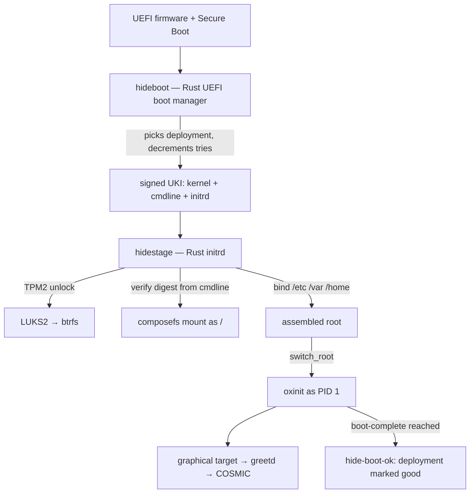
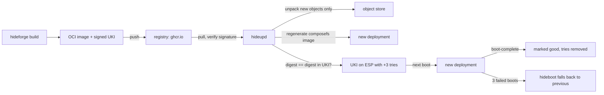

# Architecture

This document specifies how hideOS is built. It is written for the person
implementing it. Where a decision has a non-obvious reason, the reason is
stated. Decisions still open are marked **Proposed**; everything else is
**Decided** and changing it is a conversation, not a commit.

See [ROADMAP.md](ROADMAP.md) for what exists.

## What hideOS is

A Linux workstation operating system for desktops and laptops, built from
source by this project, with [oxinit](https://github.com/youhide/oxinit) as
PID 1. The model is macOS: the system is a sealed, signed, read-only image that
is replaced whole on every update, and everything the user owns lives
somewhere else.

**hideOS is the operating system built around COSMIC.** COSMIC's own pitch is
"protected against crashing": it is written in Rust, so a whole class of
crashes — memory corruption — cannot happen in it. That is a property of a
language, and it stops at the desktop's edge. hideOS extends it into a
property of the system, all the way down:

- **Below the desktop, the same language.** PID 1, the initrd, the updater and
  the boot manager are Rust, held to a stricter rule than memory safety: no
  panics on the boot path. Memory safety removes corruption; it does not
  remove a `panic!` or a logic error, and those still crash a program.
- **Around the desktop, recovery.** What Rust cannot prevent — a bad driver, a
  broken update, a power cut — the sealed image and automatic rollback make
  survivable. See [Reliability](#reliability).
- **One desktop, integrated, not supported.** COSMIC is the only desktop
  hideOS ships or tests. System features — updates, rollback, extensions,
  disk encryption, recovery — appear as COSMIC Settings pages and panel
  applets, talking to hideOS daemons over D-Bus. There is no abstraction layer
  for other desktops, and no configuration that exists only in a terminal.

## Principles

1. **The system is sealed.** `/usr` is content-addressed and verified on every
   read. Nothing writes to it, root included. A machine cannot drift away from
   the image it booted.
2. **Updates are whole deployments.** An update is a new image next to the old
   one, never a change to the running one. The previous image stays bootable,
   and falling back to it is automatic.
3. **Blast radius decides process boundaries.** Inherited from oxinit: code that
   does not have to run in a critical process does not run there. A bug in the
   updater kills the updater, not the boot.
4. **No panics on the boot path.** Every crate that runs before the user has a
   working machine — boot manager, initrd, PID 1, the commit step of the
   updater — carries oxinit's lint policy. See [Failure policy](#failure-policy).
5. **Rust-first, not Rust-only.** Everything this project writes is Rust. An
   upstream component is replaced when a Rust one is *better* — safer, smaller,
   or simpler to integrate — not because it is Rust. Until then the upstream C
   component ships, and the replacement is a roadmap item with a reason.
6. **Stateless by default.** Defaults live in `/usr`. `/etc` holds only what an
   administrator changed. Deleting `/etc` and `/var` is a factory reset.
7. **"Zero failures" means every failure is recoverable.** No system can
   promise that nothing fails. hideOS promises that no failure — a bad update, a
   crashed driver, a power cut mid-upgrade — leaves a machine that does not
   boot into a working desktop. See [Reliability](#reliability).

## The macOS model, mapped

| macOS                               | hideOS                                                        |
|-------------------------------------|---------------------------------------------------------------|
| Signed System Volume (Merkle seal)  | composefs image + fs-verity, root digest in a signed UKI      |
| APFS boot snapshot                  | A *deployment*: a composefs image over a shared object store  |
| Cryptex / Rapid Security Response   | System extension (sysext), signed and published only by hideOS |
| Data volume + firmlinks             | `/etc`, `/var`, `/home` on btrfs subvolumes                   |
| `launchd`                           | `oxinit`                                                      |
| `softwareupdate`                    | `hide update`                                                 |
| FileVault                           | LUKS2, unlocked by TPM2 (+ PIN), with a recovery key          |
| System Integrity Protection         | Sealed `/usr`, signed kernel modules only, kernel lockdown    |
| Recovery OS                         | A recovery UKI on the ESP                                     |
| Time Machine (local snapshots)      | btrfs snapshots of `/home` (send to external disk: later)     |
| `/Applications` bundles             | Flatpak                                                       |
| Homebrew / developer tools          | Containers: `hide shell` (toolbox-style, Podman)              |

## Boot chain



**hideboot** — our own UEFI boot manager, written with
[`uefi-rs`](https://github.com/rust-osdev/uefi-rs), in its own repository,
[youhide/hideBoot](https://github.com/youhide/hideBoot). Its job is small: list the
UKIs on the ESP, apply boot counting (a `+tries` suffix in the file name,
decremented before boot, as in the Boot Loader Specification), pick the newest
deployment with tries left, fall back to the previous one otherwise, and offer a
menu on a held key. Recovery images in `\EFI\Recovery` appear in the menu and
boot by themselves only when nothing in `\EFI\Linux` will. It is the boot
manager hideOS installs. `systemd-boot`, used as a standalone EFI binary,
was the stopgap before it, and is what `hideforge image` still puts on the
ESP without `--boot-manager hideboot`, which `cargo xtask` passes: it implements the same file-name convention, so either boots
the same ESP. That convention is the contract between them, and the only
thing hideOS may assume about its boot manager.

**UKI** (Unified Kernel Image). One signed PE binary per deployment containing
the kernel, the hideOS initrd and the kernel command line. The command line
carries the composefs root digest. Because the UKI is signed, the digest is
signed, and the kernel that boots will only mount the exact system image it
was built with. This is the seal.

**hidestage** is the initrd's `/init`. oxinit deliberately does not pivot the
root, so this is where that happens. In order:

1. Mount the pseudo-filesystems, wire the console.
2. Load the modules the root device needs (from the initrd, which ships only
   what the UKI's kernel needs to reach the disk).
3. Find the root partition by GPT type (Discoverable Partitions Specification).
4. Unlock LUKS2: TPM2 first, PIN if the policy wants one, passphrase or
   recovery key on the console otherwise.
5. Mount btrfs. Mount the deployment's composefs image as `/sysroot`, with the
   expected digest from the command line. A mismatch is a refusal to boot this
   deployment, not a warning: reboot, and hideboot's counter falls back.
6. Bind-mount `/etc`, `/var`, `/home` from their subvolumes. Merge any active
   sysexts over `/sysroot/usr`.
7. `switch_root` into `/sysroot` and exec `/usr/lib/oxinit/oxinit`.

hidestage is the one component where a bug bricks a boot, so it carries the
same rules as PID 1 and is small on purpose. Anything that can wait for oxinit
waits for oxinit.

## Disk layout

GPT, with the partition types of the Discoverable Partitions Specification
and the names `hideos-esp` and `hideos-root`, which are what hidestage and
`hide` look for: no `fstab` is needed to find anything, and another
system's root of the same type on the same machine is not mistaken for
hideOS's.

| Partition | Size     | Contents                                                     |
|-----------|----------|--------------------------------------------------------------|
| ESP       | 512 MiB  | hideBoot, one UKI per deployment, the recovery system         |
| Root      | the rest | LUKS2 → btrfs                                                 |

btrfs subvolumes:

| Subvolume  | Mounted at | Contents                                                     |
|------------|------------|--------------------------------------------------------------|
| `@store`   | `/hideos`  | Object store (content-addressed, fs-verity) and deployments  |
| `@etc`     | `/etc`     | Administrator overrides only                                 |
| `@var`     | `/var`     | State, logs, Flatpak installations, containers               |
| `@home`    | `/home`    | User data, snapshotted on a timer                             |
| `@swap`    | `/swap`    | Swap file, sized for hibernation                              |

Everything else in the root is the sealed image, read-only, so the few
places that must be writable are not left to chance:

- `/tmp` is a tmpfs, mounted by hidestage before oxinit starts. A directory
  in the image would be read-only, and the first casualty is the desktop:
  `dbus-run-session` puts the session bus's socket there.
- Root's home is `/var/root`, as on macOS, not `/root`, which is in the
  image. `/root` stays as an empty mount point.
- `/var/run` and `/var/lock` are links into `/run`, and `/var`'s other
  directories exist, because `hideos-units` declares them in `tmpfiles.d`
  and `hide setup` makes them. `@var` starts empty.

**Hibernation** writes memory to `/swap/swapfile`, which `hide install`
makes as large as memory. The kernel needs to know where the file is twice:
when it hibernates, and — before anything is mounted — when the next boot
resumes. The first is `hide swap`, at every boot: swap on, then
`/sys/power/resume` and `resume_offset`. The second cannot be the kernel
command line, which is signed and the same for every machine, so `hide
swap` also writes the offset into an EFI variable of hideOS's own, and
hidestage reads it and asks the kernel to resume before it mounts the disk.
Turning swap on rewrites the signature of an image that was never resumed,
so a stale one is never found later. Suspend to RAM is hidelogin's,
through `/sys/power/state`.

Why btrfs: checksums on data, cheap snapshots for `/home`, transparent
compression, fs-verity support (Linux 5.15+), and one pool instead of
pre-sized partitions. Why the system is *not* a btrfs snapshot: a snapshot is
mutable by anyone with root, and fs-verity is not. The seal is composefs; btrfs
is just where the bytes live.

## The sealed system

The image is a whole root filesystem: `/usr` with everything in it, top-level
symlinks (`/bin → usr/bin`, `/lib → usr/lib`, `/sbin → usr/bin`), and empty
mount points for `/etc`, `/var`, `/home`, `/proc`, `/sys`, `/dev`, `/run`,
`/tmp`.

**composefs** splits it in two:

- **Objects.** Every regular file's content, stored once under
  `/hideos/objects/` by its fs-verity digest, with fs-verity enabled. Two
  deployments that share a file share the object. That is the snapshot
  economy of APFS without APFS.
- **The image.** A small EROFS file holding only metadata — names, modes,
  owners, xattrs, and for each file the digest of its object. It is mounted
  with overlayfs, which fetches content from the object store and refuses an
  object whose fs-verity digest does not match.

The image's own fs-verity digest is the root of the tree. hidestage checks it
against the command line, the kernel checks every object against the image,
and the hardware checks the command line through Secure Boot.

**`/etc` is not part of the seal and does not need to be.** Programs this
project writes read defaults from `/usr/lib/<name>/` and overrides from
`/etc/<name>/`, as oxinit already does with its units. Programs that insist on
files in `/etc` get them from `/usr/share/factory/etc/`, copied on first boot
when missing and never overwritten after. System users and groups live in
`/usr/lib/passwd` and `/usr/lib/group`, read through the `altfiles` NSS module.
Only human accounts are in `/etc/passwd`.

## Updates



**Transport is OCI.** The build publishes the system as an OCI
image to a registry, the way bootc does. What that buys: delta downloads
(layers, and `zstd:chunked` within layers), mirroring and caching from any
registry, signatures with existing tooling, and the ability to inspect or run
any hideOS release as a container. What it does not change: the on-disk format
is still composefs, regenerated on the client.

**The image.** Two layers: the root, then `/boot/EFI/Linux/<uki>`. The digest
the UKI carries is that of the *boot* composefs image — the root with `/boot`
and `/sysroot` emptied, as composefs-boot makes it — so the UKI can travel
inside the image it seals. hideforge computes that digest by pulling its own
image into a composefs repository with composefs-oci, the code `hide update`
runs, and the build fails if adding the UKI layer changed it. The payload
`hide install` takes carries that same repository, so an installed system
and an updated one have the same image for the same build.

`hide update` takes `oci-archive:` and `oci:` references, which composefs-oci
reads without skopeo, and registry references. **The registry is GitHub's**:
`ghcr.io/youhide/hideos`, one tag per edition and channel
(`workstation-stable`, `minimal-edge`, …). A registry reference is fetched
by `hide`'s own client, in Rust, into an OCI layout under `/var/cache/hide`,
and pulled from there with the same code as a local image: no skopeo, and
nothing about verification changes — the digest the signed UKI carries is
still what decides. The release workflow pushes with the repository's own
token, on a `v*` tag or by hand.

**Why the client regenerates and the server signs.** composefs image
generation is deterministic: the same tree produces the same digest. The build
computes the digest, bakes it into the UKI's command line and signs the UKI.
The client unpacks, regenerates, and installs the UKI only if its own digest
matches. The client never holds a signing key.

**Atomicity.** A deployment becomes bootable at exactly one point: the rename
of its UKI into place on the ESP, after everything it references has been
written and synced. Power can be cut at any instant before that and the
machine boots the previous deployment as if nothing had happened.

**Boot counting is in the file name.** A new deployment's UKI is named
`hideos-EDITION-VERSION-DIGEST+3.efi`: hideBoot, like systemd-boot's
Automatic Boot Assessment, decrements the count before each attempt, and a UKI at `+0`
sorts after every good one, so the previous deployment boots. `hide boot-ok`
renames it without the count once the edition's target is reached. The
version is `IMAGE_VERSION` in `/usr/lib/os-release` — the commit count of the
tree it was built from — and the boot manager boots the highest version first.
`os-release` lives in `/usr/lib` and is linked from `/etc`, because `/etc` is
the machine's and would otherwise go on naming the installed version.

**What the user sees.** `hide update` downloads and stages; the change applies
on the next reboot. Nothing about the running system changes under the user.
Kept on disk: the booted deployment, the previous one, and any the user pinned.
Garbage collection removes objects no kept deployment references: it runs
at the end of every update, and its roots are the images named by the UKIs
on the ESP. The ESP is the list of what can boot, so it is also the list of
what must stay.

**Channels.** `edge` (every build that passes CI), `beta`, `stable`. A release
reaches `stable` only after it has been on `beta` machines and the
boot-success telemetry — opt-in, local-first — shows no regression.
Promotion moves a channel's tag to the image the channel before it has —
`cargo xtask promote` — never to a rebuild, and only once the image's
extensions are published. Until the telemetry exists, promoting to
`stable` is the maintainer's judgement.

### System extensions

The analogue of a Cryptex. A sysext is a composefs image in the same store as
the system, its digest signed by the hideOS key, merged over `/usr` with
overlayfs. **Only hideOS publishes them**; the machine refuses any other
signature. Three uses:

- **Rapid security responses.** A fix to a userspace component ships as a
  sysext, applied without a reboot where the component allows it, and folded
  into the next full image.
- **Hardware the base image should not carry.** The NVIDIA driver is the first:
  the open kernel modules, built for exactly the kernel of each deployment,
  plus NVIDIA's userspace, unmodified as its licence requires. Installed only
  on machines with an NVIDIA GPU. The kernel checks no module signatures
  (`CONFIG_MODULE_SIG` is off): every module it can load is in the sealed
  image or in an extension hideOS signed, and both are checked by fs-verity
  on every read, which a signature on the module would only repeat.
- **Optional system features** too large or too niche for every machine —
  virtualization host support, for example.

A sysext declares the deployment it was built for and is not merged into any
other one.

**Decided: an update brings the extensions with it.** hideOS publishes each
image's extensions beside it, in the same repository, as
`ext-<name>-<image digest>`, before the image's channel tag moves to it.
The digest is the system's — the composefs image a client computes, which
the UKI names — not the manifest's, which a push rewrites; the manifest
carries it as the annotation `os.hide.image.system`.
`hide update`, having pulled the new image, fetches the build of every
extension the machine has for that image, and only then commits; a build
that is not there stops the update, which says so and waits — a machine
whose display is NVIDIA's must not start a system without the driver. The
machine keeps one build per system image it has
(`/hideos/extensions/<name>`, one entry each), so going back to the
previous system merges the previous build, and garbage collection drops
the builds for systems no longer on the disk.

**How, and why composefs rather than dm-verity.** The first sketch was an
EROFS image with dm-verity, as systemd's sysexts are. hideOS already has a
verified store: an extension as a composefs image gets fs-verity on every
file, as the system has, shares its objects with the system, travels as an
OCI image like an update, and is mounted by the code that mounts the
system — no loop devices, no second integrity mechanism to get right.
`hideforge sysext NAME --image DIGEST` builds one from a recipe that
installs under `/usr` only, adds `extension-release.NAME` naming the image
it is for, and signs `sha256:<its composefs digest>` with the hideOS key
(RSA, PKCS #1 v1.5, SHA-256: the key and scheme the UKI is signed with).
The name and the signature are annotations on the OCI manifest, which the
digest does not cover. `hide ext add` pulls it, checks the signature, and
records it in `/hideos/extensions/NAME`; hidestage, at every boot, checks
the signature again with the public key compiled into it — trusted because
the firmware checked the UKI it is in — measures the image, mounts it, and
merges it over `/usr` only if its extension-release names the booted
image. An extension that fails any check is left out with a line on the
console; it never stops a boot.

## Editions

Two images, built from one recipe tree and sealed, updated and rolled back
the same way:

| Edition         | What it is                                                     | Image recipe   | From |
|-----------------|----------------------------------------------------------------|----------------|------|
| **Minimal**     | Kernel, oxinit, zsh, the core utilities: a terminal and nothing else. Servers, VMs, CI, and the base of everything. | `minimal`      | H1   |
| **Workstation** | Minimal and the desktop: COSMIC, PipeWire, NetworkManager, Flatpak, containers. The product. | `workstation`  | H5   |

**Workstation is Minimal plus a layer, never a sibling.** Its image recipe
depends on `minimal-base`, Minimal's contents, instead of listing the base
again, so both ship the same build of every shared package, and a fix to the
base reaches both in one release.

**An edition is its contents and what it boots to.** Each image recipe
installs the oxinit `default` target and nothing else: Minimal's requires
`multi-user` (setup, the banner, a shell on the console); Workstation's adds
the desktop's services and the greeter. That one file is why the contents
are a recipe of their own — oxinit has no drop-ins, so two editions cannot
share a closure that already decides the default.

**Packages declare what they need in `/etc` and `/var`; the machine makes
it.** System users come from `sysusers.d`, directories and links from
`tmpfiles.d` — systemd's formats, because the upstream packages already ship
them — and `hide setup` applies both, with `/etc/machine-id`, as the first
unit of every boot. At every boot rather than at install: an update can bring
a package with a new user, and `/etc` belongs to the machine, not the image.
Anything that exists is left alone.

**Switching edition is a rebase, not a reinstall.** Both are OCI images over
the same object store: `hide rebase workstation` downloads only what
Minimal lacks, and the next boot is the other edition with the same `/home`,
`/etc` and `/var`. Going back is the same command, and rollback works across
it like across any update.

Two, and not more. Every edition multiplies what CI boots — editions times
architectures — and an edition nobody tests is an edition that does not
boot. Variants smaller than an edition, like the NVIDIA driver, are system
extensions on top of one, not editions of their own.

## The desktop

COSMIC, from upstream source, built by hideforge like everything else:
`cosmic-comp`, `cosmic-session`, `cosmic-panel`, `cosmic-settings`,
`cosmic-greeter` (on greetd), `cosmic-files`, `cosmic-term`, `cosmic-edit`,
`cosmic-store`, `xdg-desktop-portal-cosmic`.

hideOS adds its own pieces, in Rust, with libcosmic, the toolkit COSMIC itself
is written in, so they are indistinguishable from the rest of the desktop:

| Piece                         | What it shows                                                   | Talks to          |
|-------------------------------|-----------------------------------------------------------------|-------------------|
| Settings → System → Updates   | Channel, available update, staged deployment, history           | `hideupd`         |
| Settings → System → Recovery  | Deployments on disk, pin, roll back, recovery key status        | `hideupd`         |
| Settings → System → Extensions| Installed and available system extensions (NVIDIA, …)           | `hideupd`         |
| Update applet in the panel    | "Restart to update" when a deployment is staged                 | `hideupd`         |
| First-boot setup              | Language, keyboard, Wi-Fi, time zone, account, disk passphrase, recovery key | `hideupd` (`os.hide.Setup1`) |
| `cosmic-store`                | Flatpak applications (upstream; hideOS adds its remote)         | Flatpak           |

The desktop is laid out as a Mac's. The menu bar is thin: hideOS's logo in
the corner where a Mac has its apple, opening Applications; on the right the
status applets, the update applet, the power menu (lock, log out, restart,
shut down) and the weekday, date and time. The dock holds the applications.
The focused window has no coloured frame (COSMIC's active hint is 0): as on
a Mac, its shadow and its title say which it is.

`hideupd` exposes a D-Bus API (`os.hide.Update1`), defined in this repository
and generated with `zbus`; the `hide` CLI and the Settings pages are both
clients of it, so there is exactly one implementation of every operation.
Privileged operations go through polkit.

hideupd is `hide daemon`, and runs each operation as `hide` itself, a child
process: the code a root shell runs is the code the daemon runs, and an
operation that fails takes nothing of the daemon with it. The child's
output comes back as `Progress` signals and its end as `Finished`. Root may
ask for anything; anyone else as polkit says (`os.hide.update.*`, an
administrator's password at the machine), and without polkit — Minimal has
none — no one else. `hide update`, `rollback`, `gc` and `ext add|remove` go
through hideupd while it runs, and do the work themselves where it does not:
the installer, the recovery system. Either way one operation runs at a
time, under a lock in `/run`.

Upstream first: a change COSMIC needs — a bug, a missing hook, an integration
point — goes upstream to pop-os, not into a hideOS patch, unless upstream
declines it.

## Applications and development

The image is for the system. Users do not install into it.

- **GUI applications: Flatpak**, from Flathub and from a hideOS remote, with
  `xdg-desktop-portal-cosmic`.
- **Command-line and development tools: containers.** `hide shell` opens a
  Podman container sharing the user's home and display, toolbox-style, with any
  distribution inside it. Compilers, language toolchains and package managers
  live there, not on the host.
- **The hideOS toolset ships in the image**: oxinit, the `hide` CLI, and the
  author's own tools as they are ported or written in Rust.

### The shell

**zsh is the login shell**, as on macOS. Not fish, although fish 4 is Rust:
the shell is the one program where compatibility with everything people paste
into it matters more than the language it is written in, and zsh accepts what
the rest of the world writes for bash. Users coming from macOS bring their
`.zshrc` with them.

What hideOS adds is the defaults. zsh is built to read its global files from
`/usr/share/zsh/` — completions, history, a prompt, key bindings that behave
like a modern terminal — and those files source `/etc/zsh/*.local` when it
exists, so the stateless rule holds: nothing in `/etc` is needed, and an
administrator's changes survive every update.

- `/bin/sh` is bash, for scripts. Not the login shell, and not dash: upstream
  packages' scripts assume bashisms more often than they admit.
- fish and nushell are not in the image. They install fine in a `hide shell`
  container, or as a Flatpak where one exists.

## Component map

**Ours (Rust)** — written by this project or the author:

| Component     | Role                                                             | Status        |
|---------------|------------------------------------------------------------------|---------------|
| `oxinit`      | PID 1, service manager, `oxctl`, `oxlogd`                        | Exists, v0.1  |
| `hideforge`   | Build system: recipes → packages → root tree → OCI image + UKI    | Exists        |
| `hidestage`   | initrd `/init`: unlock, resume, verify, assemble, `switch_root`  | Exists        |
| `hidecrypt`   | LUKS2 and TPM2 for hidestage and `hide`, host-tested             | Exists        |
| `hideupd`     | `os.hide.Update1` on the system bus: update, rollback, extensions, gc | `hide daemon` |
| `hide`        | CLI: `install`, `installer`, `recovery`, `update`, `rollback`, `status`, `ext`, `gc`, `swap`, `tpm-enroll` | Exists |
| COSMIC pieces | Settings pages, panel applet, first-boot setup (`hidesetup`)     | To write      |
| `hideboot`    | UEFI boot manager with boot counting (youhide/hideBoot)          | Exists        |
| `hidedev`     | Device manager, libudev-compatible; replaces eudev               | Later         |
| `hidelogin`   | `org.freedesktop.login1` subset; replaces elogind (see below)    | H8            |

**Upstream, already Rust:** COSMIC (compositor, panel, settings, greeter,
files, terminal, editor, portal), greetd, uutils (coreutils, findutils,
diffutils), sudo-rs, ntpd-rs, composefs-rs, rustls where a component
allows it.

**Upstream, C, shipping until replaced:**

| Component                | Why it is here                                   | Replacement path          |
|--------------------------|--------------------------------------------------|---------------------------|
| Linux                    | The kernel                                       | —                         |
| glibc                    | See [Decisions](#decisions)                      | —                         |
| Mesa, linux-firmware     | GPU drivers and firmware                         | —                         |
| eudev                    | libudev ABI that libinput, Mesa, Smithay link to | `hidedev`                 |
| ~~elogind~~              | Replaced by hidelogin in H8 — see [hidelogin](#hidelogin) | done |
| dbus-daemon              | The session and system bus                       | `busd` when it is ready   |
| PipeWire + WirePlumber   | Audio and screen capture                         | —                         |
| zsh, bash                | Login shell, and `/bin/sh` for scripts — see [The shell](#the-shell) | —           |
| NetworkManager + iwd     | Networking; COSMIC's applet talks to NM          | —                         |
| polkit                   | Authorization for COSMIC Settings                | —                         |
| cryptsetup (lib), btrfs-progs, util-linux, kmod | Storage and modules       | Partly, via hidestage     |
| Flatpak, Podman          | Applications and containers                      | —                         |

### hidelogin

**Decided (H8): hidelogin replaces elogind.** H8 asks for the reason first,
and it is not that hidelogin is Rust.

elogind is systemd 257's logind taken out of systemd, and it brings
systemd's model with it:

- **Cgroups.** It runs its own cgroup controller and moves itself and every
  session out of the tree oxinit gave them; oxinit had to learn to let it
  (oxinit#25).
- **Sleep.** It writes `/sys/power/state` by its own rules and knows
  nothing of the hibernation `hide swap` prepares.
- **What hideOS does not use.** It installs a user database, varlink tools,
  an NSS module and udev rules.
- **Its defaults.** The power key turns the machine off at once: COSMIC
  takes the key from logind only on systemd.

hidelogin is the part hideOS uses, in hideOS's terms:

- each session is a cgroup beside oxinit's, delegated to its user, so
  `oxinit --user` in it supervises its services with cgroups; under
  elogind it has none;
- shutdown goes to oxinit, as `hide poweroff` already does;
- sleep is the kernel's, and a hibernated system resumes from the swap
  file `hide swap` recorded at boot;
- the power key is COSMIC's, which asks first; the lid suspends unless a
  second display is connected or COSMIC holds it.

What it has to provide. This is a survey of the image, every consumer and
call site; anything not listed is not called:

| Way in | Who | What |
|---|---|---|
| D-Bus `org.freedesktop.login1` | cosmic-greeter, -osd, -applets, -settings-daemon, -comp; hideOS's Settings patch; NetworkManager; podman | Manager: `CreateSession(WithPIDFD)`, `ReleaseSession`, `GetSession`, `GetSessionByPID`, `GetSeat`, `GetUser`, `PowerOff`, `Reboot`, `Suspend`, `SetRebootToFirmwareSetup`, `Inhibit` (sleep delay; lid and power key block), `LidClosed`, `PrepareForSleep`, `PrepareForShutdown`. Session (and `/session/auto`): `Lock`, `SetBrightness`, `SetType`, `Id`, `Class`, `Type`, `Active`, `User`, `Lock`/`Unlock` signals. Seat: `ActiveSession`. User: `Sessions`. |
| PAM session module | greetd, for the greeter and every login | Registers the session, makes `/run/user/UID`, exports `XDG_SESSION_ID` and `XDG_RUNTIME_DIR` |
| sd-login, the C API in `libelogind` | polkit (every "active session" decision), NetworkManager, WirePlumber | `sd_pid(fd)_get_session`, `sd_session_get_uid`, `_get_seat`, `_is_active`, `sd_uid_get_state`, `_get_display`, `_get_sessions`, `_get_seats`, `sd_login_monitor_*` |
| Devices for the compositor | cosmic-comp, through libseat | Opening DRM and input devices for the active session, taking them away on a switch |
| Commands | COSMIC's lock shortcut, idle lock and Suspend action | `loginctl lock-session`, `loginctl suspend` |

How:

- **One daemon.** It serves the login1 subset and seatd's protocol. libseat
  is built with its seatd backend, the simplest of its three: cosmic-comp
  then gets its devices from hidelogin over seatd's socket, with no D-Bus
  library in between.
- **A PAM module.** It registers the session with the daemon.
- **A library with libelogind's sd-login functions and name,** answering
  from hidelogin's state files in `/run/hidelogin`, so polkit,
  NetworkManager and WirePlumber keep their builds. They build against
  `hidelogin-sd` — elogind's headers, a `libelogind.pc` naming
  `libhidelogin-sd`, and a stand-in with its symbols — and load hidelogin's
  library at run time: hidelogin is built from the workspace and changes
  with every crate, and a run dependency is not part of a recipe's hash,
  so a change here does not rebuild them.
- **A `loginctl` that locks, suspends and powers off.**
- **busctl is not replaced.** COSMIC's brightness, volume and input keys use
  it from elogind, so hideOS's COSMIC defaults call `dbus-send` instead.

The policy — who may power off, suspend, take which device — is a
host-testable library crate; the daemon is the Linux side, as in oxinit.

### What oxinit needs to grow for a desktop

These belong in the oxinit repository, not here. They are listed so the two
roadmaps stay in step.

- ~~**Per-user service management.**~~ Done (oxinit M18): `start-cosmic`
  runs `oxinit --user` beside cosmic-session, and PipeWire, WirePlumber and
  pipewire-pulse are its units in `/usr/lib/oxinit/user-units`, their output
  in `~/.local/state/oxinit/log`. Still open there: one manager per session
  rather than per person, and no way to hand a running manager a variable
  the session sets later, such as `WAYLAND_DISPLAY` — the portals are
  started by the session bus for that reason. `start-cosmic` still sends the
  session's own output to `~/.local/state/cosmic-session.log`.
- **A boot-complete signal** that hideOS can hang `hide-boot-ok` on. Possibly
  just a target; to be decided there.
- **Ordering against devices.** A unit that needs a GPU, a network interface or
  a disk should be able to say so and wait for udev.
- ~~**Hardware watchdog.**~~ Done (oxinit M17): fed from the event loop, with
  a boot deadline on `boot-ok`.

## Repositories

| Repository                                            | Contents                                         |
|-------------------------------------------------------|--------------------------------------------------|
| [youhide/hideOS](https://github.com/youhide/hideOS)   | `hideforge`, `hidestage`, `hideupd`, `hide`, recipes, image definitions |
| [youhide/oxinit](https://github.com/youhide/oxinit)   | PID 1, `oxctl`, `oxlogd`                         |
| [youhide/hideBoot](https://github.com/youhide/hideBoot) | `hideboot`                                     |

The split follows one rule: **a component gets its own repository when it is
useful without hideOS and talks to hideOS only through a published
convention.** oxinit is an init system for any Linux; it knows units, not
deployments. hideboot is a boot manager for any Boot Loader Specification
layout; it knows UKI file names and tries counters, not composefs.

Everything else shares formats that change together — the deployment layout,
the composefs digest on the command line, the OCI image schema — and a change
to any of them is one commit across builder, initrd and updater, not three
coordinated releases. Those stay in this repository.

hideOS consumes the other two as source, pinned by commit in hideforge
recipes, and builds them like any other package.

## Failure policy

Inherited from oxinit's [ARCHITECTURE.md](https://github.com/youhide/oxinit/blob/main/ARCHITECTURE.md#failure-policy)
and applied to every crate on the boot path: `hidestage`, `hideboot`, and the
commit step of `hideupd`.

```rust
#![deny(
    clippy::unwrap_used,
    clippy::expect_used,
    clippy::panic,
    clippy::indexing_slicing
)]
```

`panic = "unwind"` in every profile. `unsafe` only in one `sys` module per
crate, each block with a `// SAFETY:` comment. Errors are `thiserror` enums.

**A boot that hangs is a failed boot.** hidestage starts the hardware
watchdog — 180 seconds, `hideos.watchdog=` on the command line — and lets
go of it without stopping it, so the kernel leaves it running. oxinit takes
it over (`/usr/lib/oxinit/watchdog.toml`): it feeds it from its loop for as
long as the machine runs, and stops feeding if the `boot-ok` unit — the
deployment marked good, once the edition's target is reached — has not come
up within three minutes. A deployment that hangs anywhere, kernel or
userspace, before or after boot, is reset, and a reset before `boot-ok` is a
failed attempt like a panic (`panic=10` on the command line) or a refused
seal.

hidestage has its own last resort, because it runs before anything else can
help: if it cannot assemble the root, it does not panic the kernel. It prints
what failed and why on the console, waits 30 seconds for a person to read
it, and reboots — which hideBoot counts as a failed boot of this
deployment. It offers no shell: a shell there would run before the seal is
checked. The shell for a machine that does not start is the recovery
system's, on the ESP.

## Reliability

**Logs.** Daemons write to stdout and stderr, and oxinit hands that to
`oxlogd`, which keeps `/var/log/oxinit/<unit>.log`; `oxctl logs <unit>`
reads it. hideOS has no syslog: NetworkManager runs with `--debug`, which is
what makes it log to stderr. The console stays for the login shell.

What "no BSOD" means concretely, layer by layer:

| Failure                                 | What happens                                                         |
|-----------------------------------------|----------------------------------------------------------------------|
| Update interrupted (power, crash)       | Nothing: the new deployment was never made bootable                  |
| Update boots but is broken              | Three failed boots, hideboot falls back; `hide status` says why      |
| A file in `/usr` is corrupted or edited | The read fails with `EIO`; it cannot silently run modified code      |
| Kernel panic                            | `panic=10` reboots; pstore keeps the log; the boot counts as failed  |
| PID 1 hangs                             | Hardware watchdog reboots                                            |
| PID 1 crashes                           | It does not — see oxinit's failure policy                            |
| A service crashes                       | oxinit restarts it with backoff                                      |
| The compositor crashes                  | The session restarts; Flatpak apps keep their state where they can   |
| GPU hang                                | Kernel driver reset; compositor recovers the context                 |
| Disk corruption in user data            | btrfs checksums detect it; scrub on a monthly timer; `/home` snapshots |
| Lost disk password                      | Recovery key, shown once at first-boot setup (Minimal: at install)   |
| Everything else                         | Recovery system on the ESP: rollback or a shell; the installer reinstalls keeping `/home` |

Nothing is published that has not booted. Every image boots in QEMU in CI, x86_64
and aarch64, and passes a smoke suite — reaches the greeter, logs in, starts a
Flatpak app — before it reaches any channel. The update path itself is tested
in CI with deliberately broken images: one that fails to mount, one that
panics, one that hangs. Each must end in the previous deployment.

## Security

- **Secure Boot with hideOS's own keys** — decided. hideOS has its own
  platform key, KEK and db key; the installer enrolls them when the
  firmware is in setup mode, which on most PCs means clearing the factory
  keys in its setup screen first (`hide secureboot enroll` does the same
  later). Microsoft's KEK and db certificates are enrolled beside them
  (tools/secureboot/microsoft): option ROMs — a discrete GPU's firmware —
  are signed by Microsoft's UEFI CA, and a machine whose db lacks it can
  lose its display before anything boots; its Windows CAs keep a Windows
  beside hideOS booting; its KEK keeps its db and dbx updates — revocations
  — applying. The price: the UEFI CA also signs other distributions'
  shims, which then boot too, as with `sbctl enroll-keys --microsoft`.
  Nothing Microsoft signs is in hideOS's own chain. A Microsoft-signed
  `shim`, for machines whose firmware cannot be put in setup mode, may come
  later; it is not the default. `cargo xtask secureboot-test` takes a
  firmware with no keys to one that enforces hideOS's.
- **Until then, a development key.** `cargo xtask image` signs the UKI and
  the boot manager with Debian's "snakeoil" key, which Debian's OVMF ships
  already enrolled, with the private half published so that anyone can sign
  for it. It proves the mechanism — the firmware refuses a changed or unsigned
  kernel image — not who made the image; no machine outside QEMU trusts it.
  x86 Secure Boot keeps its variables in System Management Mode, which
  macOS's hypervisor does not offer, so on a Mac those boots run on QEMU's
  emulated CPUs: `--secure-boot` is a flag, and the desktop boots without it.
- **Measured boot.** The LUKS key is sealed to a TPM2 policy over the hideOS
  signing key (PCR 7 and a signed PCR 11 policy), not over exact hashes, so an
  update does not need re-enrollment. **Today, PCR 7 only**: Secure Boot's
  state and keys, which an update does not change. The signed PCR 11 policy
  comes with hideOS's own keys.
- **How the disk opens.** hidestage reads the LUKS2 header and derives keys
  itself (crates/hidecrypt), and maps the root with device-mapper's ioctls:
  nothing in C runs in the initrd. With a TPM and a sealed key on the ESP
  (`EFI/hideos/root.tpm2` — not secret: only that TPM, in that boot state,
  opens it), the disk opens by itself; otherwise hidestage asks for the
  passphrase, or the recovery key setup showed, on the console. The
  key is sealed at the first boot that has a TPM (`hide tpm-enroll`), from
  the running dm-crypt table, so no keyslot is added. When the TPM refuses a
  sealed key — the boot chain changed — the disk asks, and nothing re-seals
  by itself: whoever knows why it changed runs `hide tpm-enroll`. The
  session is not salted, so the key crosses the bus to a discrete TPM in
  the clear; firmware TPMs have no bus. Parameter encryption is next.
- **Kernel lockdown** in integrity mode; only modules signed by the hideOS key
  load.
- **No unsigned code in `/usr`.** Users run what they install from Flatpak
  sandboxes and containers, not from the system.

## Build

`hideforge` builds everything from source, on Linux. On macOS it runs inside a
Linux VM or container, as oxinit's `xtask` does.

- **Recipes** are TOML, one per package: source URL and hash, patches, build
  steps, outputs, dependencies.
- **Builds are hermetic**: each runs in a fresh namespace sandbox with only its
  declared dependencies, no network, fixed timestamps. The goal is
  bit-for-bit reproducible images, checked in CI by building twice.
- **Bootstrap** in three stages, Linux-From-Scratch style: a cross toolchain
  from the host distribution, a native toolchain built by that, and the final
  system built by the native one. Nothing from the host reaches the image.
- **Toolchain**: GCC for glibc and the kernel where needed, LLVM/Clang and
  `lld` elsewhere, Rust from source.
- **Outputs**: one OCI image per architecture, one signed UKI per kernel, the
  signed sysexts, and an installer ISO.

### The installer medium

`cargo xtask installer --edition E` makes a disk image to write to a USB
stick: GPT, an ESP with the boot manager and the installer's UKI —
Minimal's kernel and its whole root as the initramfs, booting into `hide
installer` — and a partition named `hideos-payload` holding E's payload as
it is, raw. Raw because a tar archive is read from a block device the same
as from a file, and a FAT file could not hold a payload over 4 GiB. The
installer asks for the disk and whether to encrypt it, and installs with
the code `hide install` runs. For the Workstation that is all: the person,
the network and the disk's secrets are the first boot's, as on a Mac (see
"First-boot setup"). Minimal has no screen to set up on, so its installer
also asks for the first account and a passphrase, and shows the recovery
key: a second LUKS2 keyslot, 200 random bits in Crockford base32, shown
once.

**A reinstall keeps `/home`.** Pointed at a disk that already holds hideOS,
the installer offers to reinstall rather than erase: it opens the disk with
its passphrase or recovery key, keeps the partitions, the LUKS2 keyslots and
`@home`, and makes the ESP and every other subvolume anew — `@etc` and `@var`
included, so what is replaced is the whole system and its configuration.
The account is asked for again; a home with its name is the account's
again. `@swap` is made anew too: a swap file kept could hold a hibernated
system that is no longer there to resume.

### Beside Windows

**Decided: as Boot Camp.** Most PCs hideOS is installed on already have
Windows, and the person keeps it. The installer does what Boot Camp
Assistant does, and says what it is doing in plain words:

- **It says what each disk holds** — "Windows, 512 GB, BitLocker on",
  "hideOS", "empty" — from the partition types and the NTFS boot sectors,
  before asking anything.
- **A disk of its own, or the space beside Windows.** A disk without
  Windows is erased and installed on, as now. A disk with Windows offers
  the largest unallocated space on it, which must be at least the
  edition's minimum; when there is not enough, the installer says how to
  make it — Windows's Disk Management, "Shrink Volume" — and stops. It
  does not resize NTFS itself: Windows knows its own volume (the page
  file, hibernation, BitLocker, restore points) and shrinks it safely,
  and a resizer in the installer would be C code for one use. Erasing a
  disk that holds Windows takes typing the word `windows`.
- **Its own ESP**, always: Windows's is usually 100 MiB, too small for
  hideOS's kernel images, and leaving it alone leaves Windows's boot
  alone. Firmware boots from any ESP; hideBoot's entry goes first in the
  boot order, Windows Boot Manager's stays.
- **hideBoot offers Windows.** It looks on every ESP of every disk for
  `\EFI\Microsoft\Boot\bootmgfw.efi` and puts "Windows" in its menu
  (a key held at power-on, as Option is on a Mac). Which system starts
  when no key is held is Settings' "Startup Disk", and "Restart in
  Windows" starts it once (`hide startup-disk`): the default and the
  one-shot choice are EFI variables, as systemd-boot's
  `LoaderEntryDefault` and `LoaderEntryOneShot` are.
- **BitLocker is found and warned about.** Enrolling hideOS's Secure Boot
  keys changes what the TPM measures (PCR 7), and Windows then asks for
  its BitLocker recovery key. The installer finds BitLocker volumes (an
  NTFS boot sector that says `-FVE-FS-`) and, before it enrolls, says
  so and offers to stop: suspend BitLocker in Windows first, or have the
  recovery key at hand.
- **The clock is kept as Windows keeps it.** Windows reads the hardware
  clock as local time, Linux as UTC; beside Windows, hideOS keeps the
  hardware clock in local time too, so that neither system shows the
  other's hours.

**NVIDIA from the installer.** The installer medium carries the
extensions published for its payload's image, and on a machine with an
NVIDIA GPU (PCI vendor `10de`, display class) the installer adds
`nvidia`, so the first start — setup included — is drawn by it. A GPU
older than Turing, which NVIDIA's open modules do not drive, is said so,
and the desktop runs on the firmware's framebuffer.

### First-boot setup

**Decided: as a Mac does it.** The Workstation's installer writes the disk
and nothing personal; the first boot opens `hidesetup` where the greeter
would be, and it asks, a page at a time: the language, the keyboard, a
Wi-Fi network (skipped when a cable is connected), the time zone, and the
account — name, login, password. With an encrypted disk it then makes that
password the disk's passphrase and shows the recovery key, once. Then the
greeter, and the person logs in.

**The disk before anyone owns it.** An encrypted disk has to open at the
first boot, before there is a passphrase to type. The installer encrypts it
with a random setup key, written to the ESP (`EFI/hideos/setup.key`), and
hidestage tries that key first. Until setup finishes the disk is therefore
as good as open to whoever holds it — and holds nothing but the system,
which is public. Setup adds the person's passphrase and the recovery key as
keyslots, then removes the setup keyslot and the file; from then on the
disk opens with the TPM, the passphrase or the recovery key, as before.

**Who may do it.** `hidesetup` is a libcosmic application, run as the
greeter's user, in the greeter's compositor: `hideos-greeter`, greetd's
session, starts it while `/var/lib/hide/setup-done` does not exist and
cosmic-greeter after. What it changes, it asks hideupd for, on the system
bus (`os.hide.Setup1`): the locale, the keyboard, the time zone, the
account, the disk. hideupd answers only the greeter's user, and only until
setup is done; after that the interface refuses everything, and the
Settings pages are how anything changes.

Development disks (`cargo xtask install`) are set up already: they carry
the account `hide` and the setup-done mark, so the tests log in as before.

### Recovery

The installer puts a recovery system on the ESP, at
`\EFI\Recovery\hideos-recovery.efi`: Minimal's kernel and its whole root as
a zstd initramfs, booting into `hide recovery`. It runs from memory, so
nothing on the disk has to work for it to. hideBoot lists it in its menu —
held key at startup — and boots it by itself only when no entry in
`\EFI\Linux` will start. It never counts its attempts and is never the
default.

It offers a rollback a person chooses: the deployments on the ESP, and the
one chosen made the one that starts next, by the same renames the boot
counter makes. And a shell, with the disk opened and mounted at `/mnt`.

It does not reinstall: it carries no payload, and the store on the disk is
the thing that might be broken. Reinstalling is the installer's, from the
medium, which carries the whole system.

**The console is the screen.** Every UKI ends its command line with
`console=tty0`, so `/dev/console` — where hidestage asks for the passphrase,
the installer asks its questions and Minimal's login shell runs — is the
screen. The kernel writes to the serial port too. Test images append
`console=ttyS0`, which makes the serial port the console, so the tests can
read and type.

### Disk images are installed, not assembled

A bootable disk needs fs-verity enabled on every object, and fs-verity is
enabled by the kernel of the machine that writes the file. The builder's
kernel is whatever its host provides — Docker Desktop's has no
`CONFIG_FS_VERITY` — so the builder cannot write a sealed disk, and a disk
written without verity would not mount under `verity=require`.

So hideforge stops at the payload: the composefs repository (objects and the
EROFS image, pulled from the OCI image as a client would), the UKI, and the
ESP's contents — and at the OCI image itself, as an oci-archive, for updates. A disk image is made by
booting hideOS Minimal in QEMU with an empty disk and the payload attached,
and running `hide install` — the same tool, with the same code path, that
installs hideOS on a real machine in H7. Every disk image the build produces
is therefore also a test of the installer.

## Decisions

| Decision                                     | Status       | Reason in one line                                              |
|----------------------------------------------|--------------|-----------------------------------------------------------------|
| Sealed image system on composefs + fs-verity | **Decided**  | The macOS SSV model: a system that cannot drift or half-update  |
| glibc                                        | **Decided**  | NVIDIA userspace, Steam and binary applications require it      |
| COSMIC as the desktop                        | **Decided**  | Complete, Wayland, Rust end to end                              |
| x86_64 and aarch64, AMD/Intel and NVIDIA     | **Decided**  | The machines it will run on                                     |
| btrfs on LUKS2 for data                      | **Decided**  | Checksums, snapshots, fs-verity, one pool                       |
| Only hideOS-signed sysexts                   | **Decided**  | Like Cryptexes: extensions are part of the system, not the user's |
| OCI as update transport                      | **Decided**  | Deltas, registries and signing tooling for free                 |
| Own UEFI boot manager (`hideboot`), in H7    | **Decided**  | Boot counting is the rollback; it should be ours and in Rust    |
| Secure Boot with hideOS's own keys           | **Decided**  | The chain is hideOS's alone; Microsoft's db kept for option ROMs; shim maybe later |
| Updates published on ghcr.io/youhide/hideos  | **Decided**  | Free for a public repository; the release workflow's token pushes |
| First-boot setup as on a Mac (`hidesetup`)   | **Decided**  | The installer writes a disk; the person is the first boot's     |
| Updates bring the extensions they need       | **Decided**  | An NVIDIA machine never boots a system without its driver       |
| Beside Windows, as Boot Camp                 | **Decided**  | Most PCs keep Windows; hideOS installs beside it and offers it  |
| Device manager in Rust                       | **Later**    | eudev works; replace once there is a reason, as with hidelogin  |
| hidelogin replaces elogind                   | **Decided**  | Sessions, sleep and shutdown in hideOS's and oxinit's terms     |

aarch64 note: generic UEFI aarch64 machines (Ampere, Raspberry Pi 5 with UEFI
firmware, QEMU `virt`) are the target. Snapdragon X laptops depend on upstream
kernel support that is still landing. Apple Silicon is Asahi's territory, with
its own boot chain, and is not a v1 target.
