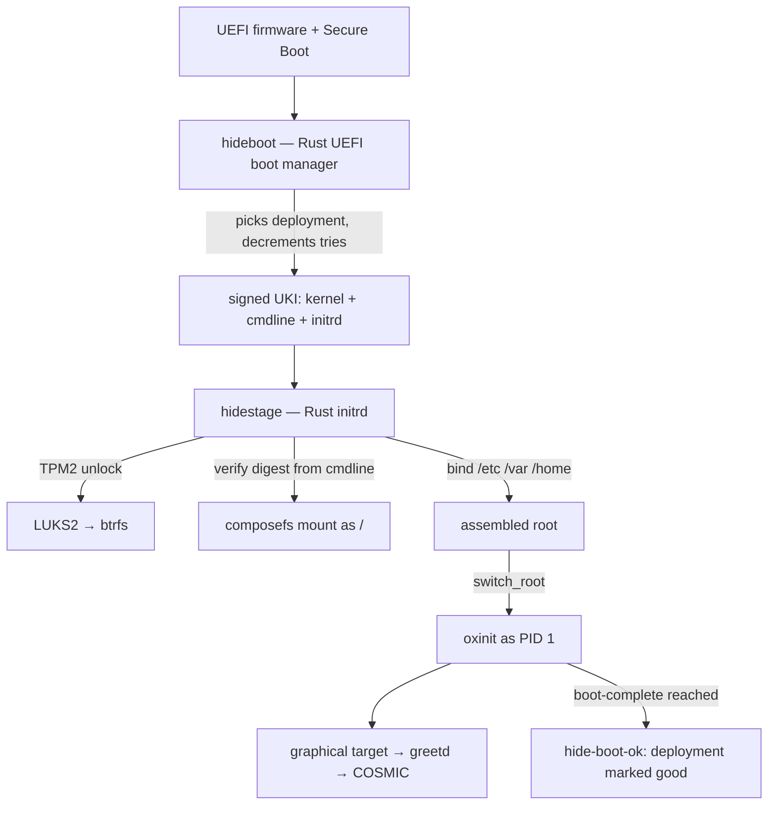
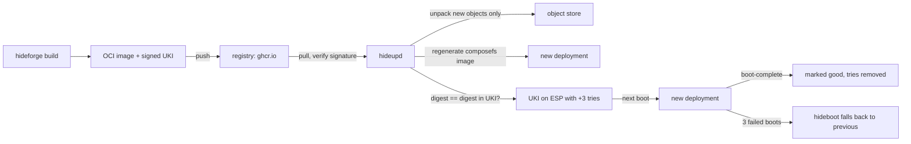

# Architecture

This document specifies how hideOS is built. It is written for the person
implementing it. Where a decision has a non-obvious reason, the reason is
stated. Decisions still open are marked **Proposed**; everything else is
**Decided** and changing it is a conversation, not a commit.

See [ROADMAP.md](ROADMAP.md) for what exists.

## What hideOS is

A Linux workstation operating system for desktops and laptops, built from
source by this project, with [oxinit](https://github.com/youhide/oxinit) as
PID 1. The model is macOS: the system is a sealed, signed, read-only image that
is replaced whole on every update, and everything the user owns lives
somewhere else.

**hideOS is the operating system built around COSMIC.** COSMIC's own pitch is
"protected against crashing": it is written in Rust, so a whole class of
crashes — memory corruption — cannot happen in it. That is a property of a
language, and it stops at the desktop's edge. hideOS extends it into a
property of the system, all the way down:

- **Below the desktop, the same language.** PID 1, the initrd, the updater and
  the boot manager are Rust, held to a stricter rule than memory safety: no
  panics on the boot path. Memory safety removes corruption; it does not
  remove a `panic!` or a logic error, and those still crash a program.
- **Around the desktop, recovery.** What Rust cannot prevent — a bad driver, a
  broken update, a power cut — the sealed image and automatic rollback make
  survivable. See [Reliability](#reliability).
- **One desktop, integrated, not supported.** COSMIC is the only desktop
  hideOS ships or tests. System features — updates, rollback, extensions,
  disk encryption, recovery — appear as COSMIC Settings pages and panel
  applets, talking to hideOS daemons over D-Bus. There is no abstraction layer
  for other desktops, and no configuration that exists only in a terminal.

## Principles

1. **The system is sealed.** `/usr` is content-addressed and verified on every
   read. Nothing writes to it, root included. A machine cannot drift away from
   the image it booted.
2. **Updates are whole deployments.** An update is a new image next to the old
   one, never a change to the running one. The previous image stays bootable,
   and falling back to it is automatic.
3. **Blast radius decides process boundaries.** Inherited from oxinit: code that
   does not have to run in a critical process does not run there. A bug in the
   updater kills the updater, not the boot.
4. **No panics on the boot path.** Every crate that runs before the user has a
   working machine — boot manager, initrd, PID 1, the commit step of the
   updater — carries oxinit's lint policy. See [Failure policy](#failure-policy).
5. **Rust-first, not Rust-only.** Everything this project writes is Rust. An
   upstream component is replaced when a Rust one is *better* — safer, smaller,
   or simpler to integrate — not because it is Rust. Until then the upstream C
   component ships, and the replacement is a roadmap item with a reason.
6. **Stateless by default.** Defaults live in `/usr`. `/etc` holds only what an
   administrator changed. Deleting `/etc` and `/var` is a factory reset.
7. **"Zero failures" means every failure is recoverable.** No system can
   promise that nothing fails. hideOS promises that no failure — a bad update, a
   crashed driver, a power cut mid-upgrade — leaves a machine that does not
   boot into a working desktop. See [Reliability](#reliability).

## The macOS model, mapped

| macOS                               | hideOS                                                        |
|-------------------------------------|---------------------------------------------------------------|
| Signed System Volume (Merkle seal)  | composefs image + fs-verity, root digest in a signed UKI      |
| APFS boot snapshot                  | A *deployment*: a composefs image over a shared object store  |
| Cryptex / Rapid Security Response   | System extension (sysext), signed and published only by hideOS |
| Data volume + firmlinks             | `/etc`, `/var`, `/home` on btrfs subvolumes                   |
| `launchd`                           | `oxinit`                                                      |
| `softwareupdate`                    | `hide update`                                                 |
| FileVault                           | LUKS2, unlocked by TPM2 (+ PIN), with a recovery key          |
| System Integrity Protection         | Sealed `/usr`, signed kernel modules only, kernel lockdown    |
| Recovery OS                         | A recovery UKI on the ESP                                     |
| Time Machine (local snapshots)      | btrfs snapshots of `/home` (send to external disk: later)     |
| `/Applications` bundles             | Flatpak                                                       |
| Homebrew / developer tools          | Containers: `hide shell` (toolbox-style, Podman)              |

## Boot chain



**hideboot** — our own UEFI boot manager, written with
[`uefi-rs`](https://github.com/rust-osdev/uefi-rs), in its own repository,
[youhide/hideBoot](https://github.com/youhide/hideBoot). Its job is small: list the
UKIs on the ESP, apply boot counting (a `+tries` suffix in the file name,
decremented before boot, as in the Boot Loader Specification), pick the newest
deployment with tries left, fall back to the previous one otherwise, and offer a
menu on a held key. It lands in H7. Until then the stopgap is `systemd-boot`
used as a standalone EFI binary — it already implements the same file-name
convention, so switching later changes nothing on disk. That convention is the
contract between the two, and the only thing hideOS may assume about its boot
manager.

**UKI** (Unified Kernel Image). One signed PE binary per deployment containing
the kernel, the hideOS initrd and the kernel command line. The command line
carries the composefs root digest. Because the UKI is signed, the digest is
signed, and the kernel that boots will only mount the exact system image it
was built with. This is the seal.

**hidestage** is the initrd's `/init`. oxinit deliberately does not pivot the
root, so this is where that happens. In order:

1. Mount the pseudo-filesystems, wire the console.
2. Load the modules the root device needs (from the initrd, which ships only
   what the UKI's kernel needs to reach the disk).
3. Find the root partition by GPT type (Discoverable Partitions Specification).
4. Unlock LUKS2: TPM2 first, PIN if the policy wants one, passphrase or
   recovery key on the console otherwise.
5. Mount btrfs. Mount the deployment's composefs image as `/sysroot`, with the
   expected digest from the command line. A mismatch is a refusal to boot this
   deployment, not a warning: reboot, and hideboot's counter falls back.
6. Bind-mount `/etc`, `/var`, `/home` from their subvolumes. Merge any active
   sysexts over `/sysroot/usr`.
7. `switch_root` into `/sysroot` and exec `/usr/lib/oxinit/oxinit`.

hidestage is the one component where a bug bricks a boot, so it carries the
same rules as PID 1 and is small on purpose. Anything that can wait for oxinit
waits for oxinit.

## Disk layout

GPT, partition types from the Discoverable Partitions Specification, so no
`fstab` is needed to find anything.

| Partition | Size     | Contents                                                     |
|-----------|----------|--------------------------------------------------------------|
| ESP       | 2 GiB    | `hideboot.efi`, one UKI per deployment, the recovery UKI     |
| Root      | the rest | LUKS2 → btrfs                                                 |

btrfs subvolumes:

| Subvolume  | Mounted at | Contents                                                     |
|------------|------------|--------------------------------------------------------------|
| `@store`   | `/hideos`  | Object store (content-addressed, fs-verity) and deployments  |
| `@etc`     | `/etc`     | Administrator overrides only                                 |
| `@var`     | `/var`     | State, logs, Flatpak installations, containers               |
| `@home`    | `/home`    | User data, snapshotted on a timer                             |
| `@swap`    | `/swap`    | Swap file, sized for hibernation                              |

Why btrfs: checksums on data, cheap snapshots for `/home`, transparent
compression, fs-verity support (Linux 5.15+), and one pool instead of
pre-sized partitions. Why the system is *not* a btrfs snapshot: a snapshot is
mutable by anyone with root, and fs-verity is not. The seal is composefs; btrfs
is just where the bytes live.

## The sealed system

The image is a whole root filesystem: `/usr` with everything in it, top-level
symlinks (`/bin → usr/bin`, `/lib → usr/lib`, `/sbin → usr/bin`), and empty
mount points for `/etc`, `/var`, `/home`, `/proc`, `/sys`, `/dev`, `/run`,
`/tmp`.

**composefs** splits it in two:

- **Objects.** Every regular file's content, stored once under
  `/hideos/objects/` by its fs-verity digest, with fs-verity enabled. Two
  deployments that share a file share the object. That is the snapshot
  economy of APFS without APFS.
- **The image.** A small EROFS file holding only metadata — names, modes,
  owners, xattrs, and for each file the digest of its object. It is mounted
  with overlayfs, which fetches content from the object store and refuses an
  object whose fs-verity digest does not match.

The image's own fs-verity digest is the root of the tree. hidestage checks it
against the command line, the kernel checks every object against the image,
and the hardware checks the command line through Secure Boot.

**`/etc` is not part of the seal and does not need to be.** Programs this
project writes read defaults from `/usr/lib/<name>/` and overrides from
`/etc/<name>/`, as oxinit already does with its units. Programs that insist on
files in `/etc` get them from `/usr/share/factory/etc/`, copied on first boot
when missing and never overwritten after. System users and groups live in
`/usr/lib/passwd` and `/usr/lib/group`, read through the `altfiles` NSS module.
Only human accounts are in `/etc/passwd`.

## Updates



**Transport is OCI.** The build publishes the system as an OCI
image to a registry, the way bootc does. What that buys: delta downloads
(layers, and `zstd:chunked` within layers), mirroring and caching from any
registry, signatures with existing tooling, and the ability to inspect or run
any hideOS release as a container. What it does not change: the on-disk format
is still composefs, regenerated on the client.

**Why the client regenerates and the server signs.** composefs image
generation is deterministic: the same tree produces the same digest. The build
computes the digest, bakes it into the UKI's command line and signs the UKI.
The client unpacks, regenerates, and installs the UKI only if its own digest
matches. The client never holds a signing key.

**Atomicity.** A deployment becomes bootable at exactly one point: the rename
of its UKI into place on the ESP, after everything it references has been
written and synced. Power can be cut at any instant before that and the
machine boots the previous deployment as if nothing had happened.

**What the user sees.** `hide update` downloads and stages; the change applies
on the next reboot. Nothing about the running system changes under the user.
Kept on disk: the booted deployment, the previous one, and any the user pinned.
Garbage collection removes objects no kept deployment references.

**Channels.** `edge` (every build that passes CI), `beta`, `stable`. A release
reaches `stable` only after it has been on `beta` machines and the
boot-success telemetry — opt-in, local-first — shows no regression.

### System extensions

The analogue of a Cryptex. A sysext is an EROFS image with dm-verity, signed
by the hideOS key, merged over `/usr` with overlayfs. **Only hideOS publishes
them**; the machine refuses any other signature. Three uses:

- **Rapid security responses.** A fix to a userspace component ships as a
  sysext, applied without a reboot where the component allows it, and folded
  into the next full image.
- **Hardware the base image should not carry.** The NVIDIA driver is the first:
  the open kernel modules, built for exactly the kernel of each deployment and
  signed with the hideOS module key, plus the proprietary userspace. Installed
  only on machines with an NVIDIA GPU.
- **Optional system features** too large or too niche for every machine —
  virtualization host support, for example.

A sysext declares the deployment it was built for and is not merged into any
other one.

## The desktop

COSMIC, from upstream source, built by hideforge like everything else:
`cosmic-comp`, `cosmic-session`, `cosmic-panel`, `cosmic-settings`,
`cosmic-greeter` (on greetd), `cosmic-files`, `cosmic-term`, `cosmic-edit`,
`cosmic-store`, `xdg-desktop-portal-cosmic`.

hideOS adds its own pieces, in Rust, with libcosmic, the toolkit COSMIC itself
is written in, so they are indistinguishable from the rest of the desktop:

| Piece                         | What it shows                                                   | Talks to          |
|-------------------------------|-----------------------------------------------------------------|-------------------|
| Settings → System → Updates   | Channel, available update, staged deployment, history           | `hideupd`         |
| Settings → System → Recovery  | Deployments on disk, pin, roll back, recovery key status        | `hideupd`         |
| Settings → System → Extensions| Installed and available system extensions (NVIDIA, …)           | `hideupd`         |
| Update applet in the panel    | "Restart to update" when a deployment is staged                 | `hideupd`         |
| First-boot setup              | User, network, disk-encryption PIN, recovery key                | `hidesetup`       |
| `cosmic-store`                | Flatpak applications (upstream; hideOS adds its remote)         | Flatpak           |

`hideupd` exposes a D-Bus API (`os.hide.Update1`), defined in this repository
and generated with `zbus`; the `hide` CLI and the Settings pages are both
clients of it, so there is exactly one implementation of every operation.
Privileged operations go through polkit.

Upstream first: a change COSMIC needs — a bug, a missing hook, an integration
point — goes upstream to pop-os, not into a hideOS patch, unless upstream
declines it.

## Applications and development

The image is for the system. Users do not install into it.

- **GUI applications: Flatpak**, from Flathub and from a hideOS remote, with
  `xdg-desktop-portal-cosmic`.
- **Command-line and development tools: containers.** `hide shell` opens a
  Podman container sharing the user's home and display, toolbox-style, with any
  distribution inside it. Compilers, language toolchains and package managers
  live there, not on the host.
- **The hideOS toolset ships in the image**: oxinit, the `hide` CLI, and the
  author's own tools as they are ported or written in Rust.

### The shell

**zsh is the login shell**, as on macOS. Not fish, although fish 4 is Rust:
the shell is the one program where compatibility with everything people paste
into it matters more than the language it is written in, and zsh accepts what
the rest of the world writes for bash. Users coming from macOS bring their
`.zshrc` with them.

What hideOS adds is the defaults. zsh is built to read its global files from
`/usr/share/zsh/` — completions, history, a prompt, key bindings that behave
like a modern terminal — and those files source `/etc/zsh/*.local` when it
exists, so the stateless rule holds: nothing in `/etc` is needed, and an
administrator's changes survive every update.

- `/bin/sh` is bash, for scripts. Not the login shell, and not dash: upstream
  packages' scripts assume bashisms more often than they admit.
- fish and nushell are not in the image. They install fine in a `hide shell`
  container, or as a Flatpak where one exists.

## Component map

**Ours (Rust)** — written by this project or the author:

| Component     | Role                                                             | Status        |
|---------------|------------------------------------------------------------------|---------------|
| `oxinit`      | PID 1, service manager, `oxctl`, `oxlogd`                        | Exists, v0.1  |
| `hideforge`   | Build system: recipes → packages → root tree → OCI image + UKI    | To write      |
| `hidestage`   | initrd `/init`: unlock, verify, assemble, `switch_root`          | To write      |
| `hideupd`     | Update daemon: pull, unpack, deploy, garbage-collect             | To write      |
| `hide`        | User-facing CLI: `update`, `rollback`, `status`, `ext`, `shell`  | To write      |
| COSMIC pieces | Settings pages, panel applet, first-boot setup (`hidesetup`)     | To write      |
| `hideboot`    | UEFI boot manager with boot counting (youhide/hideBoot)          | H7            |
| `hidedev`     | Device manager, libudev-compatible; replaces eudev               | Later         |
| `hidelogin`   | `org.freedesktop.login1` subset; replaces elogind                | Later         |

**Upstream, already Rust:** COSMIC (compositor, panel, settings, greeter,
files, terminal, editor, portal), greetd, uutils (coreutils, findutils,
diffutils), sudo-rs, ntpd-rs, composefs-rs, rustls where a component
allows it.

**Upstream, C, shipping until replaced:**

| Component                | Why it is here                                   | Replacement path          |
|--------------------------|--------------------------------------------------|---------------------------|
| Linux                    | The kernel                                       | —                         |
| glibc                    | See [Decisions](#decisions)                      | —                         |
| Mesa, linux-firmware     | GPU drivers and firmware                         | —                         |
| eudev                    | libudev ABI that libinput, Mesa, Smithay link to | `hidedev`                 |
| elogind                  | Seats, sessions, suspend, lid — COSMIC needs logind's D-Bus API | `hidelogin` |
| dbus-daemon              | The session and system bus                       | `busd` when it is ready   |
| PipeWire + WirePlumber   | Audio and screen capture                         | —                         |
| zsh, bash                | Login shell, and `/bin/sh` for scripts — see [The shell](#the-shell) | —           |
| NetworkManager + iwd     | Networking; COSMIC's applet talks to NM          | —                         |
| polkit                   | Authorization for COSMIC Settings                | —                         |
| cryptsetup (lib), btrfs-progs, util-linux, kmod | Storage and modules       | Partly, via hidestage     |
| Flatpak, Podman          | Applications and containers                      | —                         |

### What oxinit needs to grow for a desktop

These belong in the oxinit repository, not here. They are listed so the two
roadmaps stay in step.

- **Per-user service management.** PipeWire, WirePlumber, portals and the
  COSMIC session are per-user services. oxinit today refuses to run unless it
  is PID 1. A user instance, started per login session, is the largest gap.
- **A boot-complete signal** that hideOS can hang `hide-boot-ok` on. Possibly
  just a target; to be decided there.
- **Ordering against devices.** A unit that needs a GPU, a network interface or
  a disk should be able to say so and wait for udev.
- **Hardware watchdog.** Feed `/dev/watchdog` from the event loop, so a hung
  PID 1 reboots the machine — and the reboot counts against the deployment.

## Repositories

| Repository                                            | Contents                                         |
|-------------------------------------------------------|--------------------------------------------------|
| [youhide/hideOS](https://github.com/youhide/hideOS)   | `hideforge`, `hidestage`, `hideupd`, `hide`, recipes, image definitions |
| [youhide/oxinit](https://github.com/youhide/oxinit)   | PID 1, `oxctl`, `oxlogd`                         |
| [youhide/hideBoot](https://github.com/youhide/hideBoot) | `hideboot`                                     |

The split follows one rule: **a component gets its own repository when it is
useful without hideOS and talks to hideOS only through a published
convention.** oxinit is an init system for any Linux; it knows units, not
deployments. hideboot is a boot manager for any Boot Loader Specification
layout; it knows UKI file names and tries counters, not composefs.

Everything else shares formats that change together — the deployment layout,
the composefs digest on the command line, the OCI image schema — and a change
to any of them is one commit across builder, initrd and updater, not three
coordinated releases. Those stay in this repository.

hideOS consumes the other two as source, pinned by commit in hideforge
recipes, and builds them like any other package.

## Failure policy

Inherited from oxinit's [ARCHITECTURE.md](https://github.com/youhide/oxinit/blob/main/ARCHITECTURE.md#failure-policy)
and applied to every crate on the boot path: `hidestage`, `hideboot`, and the
commit step of `hideupd`.

```rust
#![deny(
    clippy::unwrap_used,
    clippy::expect_used,
    clippy::panic,
    clippy::indexing_slicing
)]
```

`panic = "unwind"` in every profile. `unsafe` only in one `sys` module per
crate, each block with a `// SAFETY:` comment. Errors are `thiserror` enums.

hidestage has its own last resort, because it runs before anything else can
help: if it cannot assemble the root, it does not panic the kernel. It prints
what failed and why on the console, offers a shell, and on a timeout reboots —
which hideboot counts as a failed boot of this deployment.

## Reliability

What "no BSOD" means concretely, layer by layer:

| Failure                                 | What happens                                                         |
|-----------------------------------------|----------------------------------------------------------------------|
| Update interrupted (power, crash)       | Nothing: the new deployment was never made bootable                  |
| Update boots but is broken              | Three failed boots, hideboot falls back; `hide status` says why      |
| A file in `/usr` is corrupted or edited | The read fails with `EIO`; it cannot silently run modified code      |
| Kernel panic                            | `panic=10` reboots; pstore keeps the log; the boot counts as failed  |
| PID 1 hangs                             | Hardware watchdog reboots                                            |
| PID 1 crashes                           | It does not — see oxinit's failure policy                            |
| A service crashes                       | oxinit restarts it with backoff                                      |
| The compositor crashes                  | The session restarts; Flatpak apps keep their state where they can   |
| GPU hang                                | Kernel driver reset; compositor recovers the context                 |
| Disk corruption in user data            | btrfs checksums detect it; scrub on a monthly timer; `/home` snapshots |
| Lost disk password                      | Recovery key, printed at install                                     |
| Everything else                         | Recovery UKI on the ESP: rollback, reinstall, or a shell             |

Nothing is published that has not booted. Every image boots in QEMU in CI, x86_64
and aarch64, and passes a smoke suite — reaches the greeter, logs in, starts a
Flatpak app — before it reaches any channel. The update path itself is tested
in CI with deliberately broken images: one that fails to mount, one that
panics, one that hangs. Each must end in the previous deployment.

## Security

- **Secure Boot** with hideOS keys. The installer enrolls them in setup mode,
  or uses the Microsoft-signed `shim` when it cannot — **Proposed**, decided
  when the installer is written.
- **Measured boot.** The LUKS key is sealed to a TPM2 policy over the hideOS
  signing key (PCR 7 and a signed PCR 11 policy), not over exact hashes, so an
  update does not need re-enrollment.
- **Kernel lockdown** in integrity mode; only modules signed by the hideOS key
  load.
- **No unsigned code in `/usr`.** Users run what they install from Flatpak
  sandboxes and containers, not from the system.

## Build

`hideforge` builds everything from source, on Linux. On macOS it runs inside a
Linux VM or container, as oxinit's `xtask` does.

- **Recipes** are TOML, one per package: source URL and hash, patches, build
  steps, outputs, dependencies.
- **Builds are hermetic**: each runs in a fresh namespace sandbox with only its
  declared dependencies, no network, fixed timestamps. The goal is
  bit-for-bit reproducible images, checked in CI by building twice.
- **Bootstrap** in three stages, Linux-From-Scratch style: a cross toolchain
  from the host distribution, a native toolchain built by that, and the final
  system built by the native one. Nothing from the host reaches the image.
- **Toolchain**: GCC for glibc and the kernel where needed, LLVM/Clang and
  `lld` elsewhere, Rust from source.
- **Outputs**: one OCI image per architecture, one signed UKI per kernel, the
  signed sysexts, and an installer ISO.

## Decisions

| Decision                                     | Status       | Reason in one line                                              |
|----------------------------------------------|--------------|-----------------------------------------------------------------|
| Sealed image system on composefs + fs-verity | **Decided**  | The macOS SSV model: a system that cannot drift or half-update  |
| glibc                                        | **Decided**  | NVIDIA userspace, Steam and binary applications require it      |
| COSMIC as the desktop                        | **Decided**  | Complete, Wayland, Rust end to end                              |
| x86_64 and aarch64, AMD/Intel and NVIDIA     | **Decided**  | The machines it will run on                                     |
| btrfs on LUKS2 for data                      | **Decided**  | Checksums, snapshots, fs-verity, one pool                       |
| Only hideOS-signed sysexts                   | **Decided**  | Like Cryptexes: extensions are part of the system, not the user's |
| OCI as update transport                      | **Decided**  | Deltas, registries and signing tooling for free                 |
| Own UEFI boot manager (`hideboot`), in H7    | **Decided**  | Boot counting is the rollback; it should be ours and in Rust    |
| Secure Boot via own keys vs. shim            | **Proposed** | Decided with the installer, by what laptops in setup mode allow |
| Device manager and logind in Rust            | **Later**    | eudev and elogind work; replace after the desktop is daily-driven |

aarch64 note: generic UEFI aarch64 machines (Ampere, Raspberry Pi 5 with UEFI
firmware, QEMU `virt`) are the target. Snapdragon X laptops depend on upstream
kernel support that is still landing. Apple Silicon is Asahi's territory, with
its own boot chain, and is not a v1 target.
