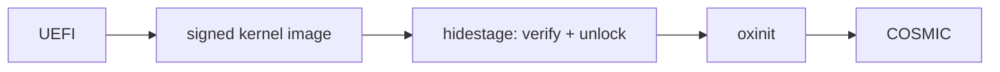

# hideOS

The operating system built around [COSMIC](https://system76.com/cosmic).
A Linux workstation OS, built from source, with
[oxinit](https://github.com/youhide/oxinit) as PID 1.

COSMIC is protected against crashing because it is written in Rust. hideOS
takes that from the desktop down to the boot: Rust underneath, a sealed system
that cannot be corrupted, and updates that roll themselves back when they fail.

**Pre-alpha. Nothing boots yet.** See [ROADMAP.md](ROADMAP.md).

## The idea

hideOS works like macOS, on Linux:

- **The system is sealed.** It is one signed, read-only image, verified on every
  read. Nothing — root included — can change it.
- **Updates replace the whole image.** The old one stays on disk. If the new one
  does not boot, the machine goes back by itself.
- **Your things live elsewhere.** `/home`, settings and data are never touched by
  an update. Applications come from Flatpak, development tools from containers.

Under that: Rust wherever this project writes code, the COSMIC desktop, glibc,
btrfs on LUKS2 with TPM2 unlock, x86_64 and aarch64, AMD, Intel and NVIDIA
graphics.

## Read next

- [ARCHITECTURE.md](ARCHITECTURE.md) — how it is built and why.
- [ROADMAP.md](ROADMAP.md) — what exists and what comes next.

## License

Licensed under either of [Apache License, Version 2.0](LICENSE-APACHE) or
[MIT license](LICENSE-MIT) at your option.
