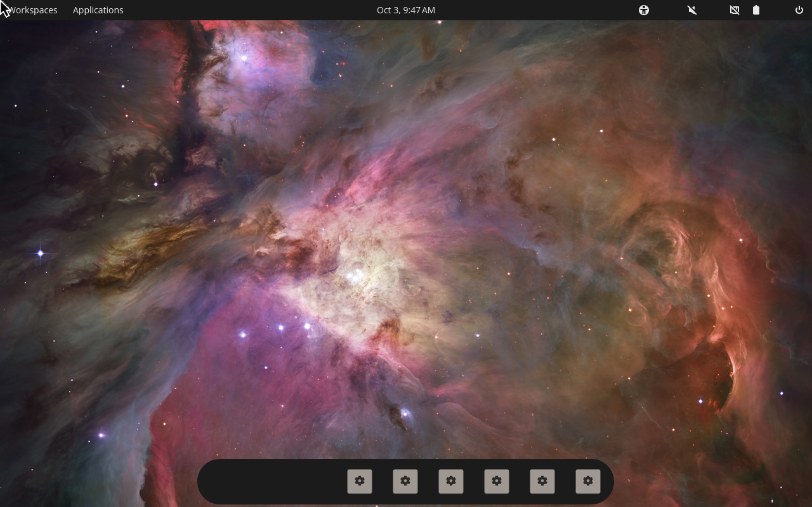
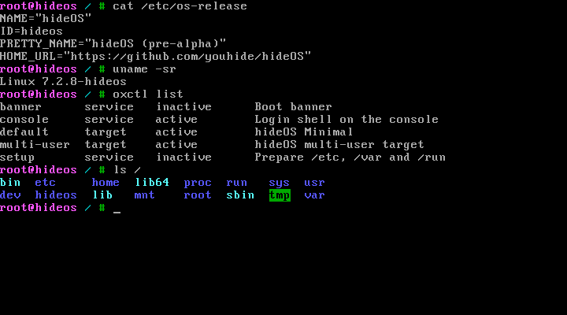

# hideOS

The operating system built around [COSMIC](https://system76.com/cosmic).
A Linux workstation OS, built from source, with
[oxinit](https://github.com/youhide/oxinit) as PID 1.

COSMIC is protected against crashing because it is written in Rust. hideOS
takes that from the desktop down to the boot: Rust underneath, a sealed system
that cannot be corrupted, and updates that roll themselves back when they fail.

**Pre-alpha.** hideOS builds itself from source, installs itself on a disk,
and boots it sealed — UEFI, hideBoot, a kernel image carrying the
system's digest, a read-only root checked by fs-verity — under oxinit, in
QEMU: Minimal to a shell, Workstation to the COSMIC desktop. Not yet for
daily use; see [ROADMAP.md](ROADMAP.md). Site:
<https://youhide.github.io/hideOS/>.





That screenshot is not a mock-up: `cargo xtask screenshot` boots the image
hideforge built and types those commands at its console.

```bash
cargo xtask builder build   # the Linux build environment, once
cargo xtask image           # build hideOS Minimal from source
cargo xtask boot            # boot it in QEMU, from RAM
cargo xtask install         # install it on a disk image, as on a machine
cargo xtask boot --disk     # boot that disk through UEFI
cargo xtask seal-test       # try to break the seal, under Secure Boot
```

The Workstation is the same with `--edition workstation`; it boots only
from its disk, in a window, and the development disk's account is `hide`,
password `hide`. Its first build is most of a day on a 2018 laptop: LLVM,
Mesa and twenty COSMIC components.

The first `image` bootstraps a toolchain and the whole system from source,
about two hours on a 2018 laptop; after that, only what changed rebuilds.

## The idea

hideOS works like macOS, on Linux:

- **The system is sealed.** It is one signed, read-only image, verified on every
  read. Nothing — root included — can change it.
- **Updates replace the whole image.** The old one stays on disk. If the new one
  does not boot, the machine goes back by itself.
- **Your things live elsewhere.** `/home`, settings and data are never touched by
  an update. Applications come from Flatpak, development tools from containers.

Two editions, from the same tree: **Minimal**, a terminal and nothing else,
and **Workstation**, which is Minimal with the COSMIC desktop on top.
Switching between them is an update, not a reinstall.

Under that: Rust wherever this project writes code, the COSMIC desktop, glibc,
btrfs on LUKS2 with TPM2 unlock, x86_64 and aarch64, AMD, Intel and NVIDIA
graphics.


## Read next

- [ARCHITECTURE.md](ARCHITECTURE.md) — how it is built and why.
- [ROADMAP.md](ROADMAP.md) — what exists and what comes next.

## License

Licensed under either of [Apache License, Version 2.0](LICENSE-APACHE) or
[MIT license](LICENSE-MIT) at your option.
